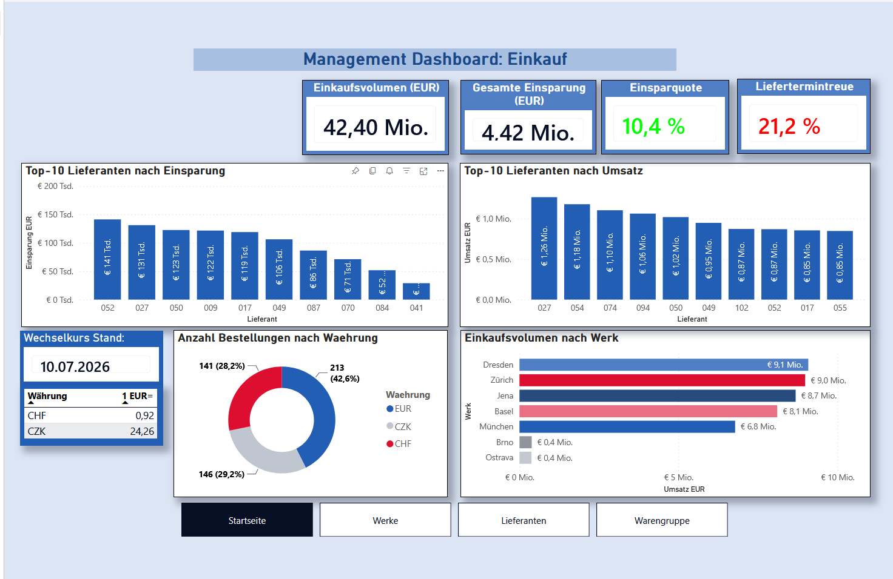
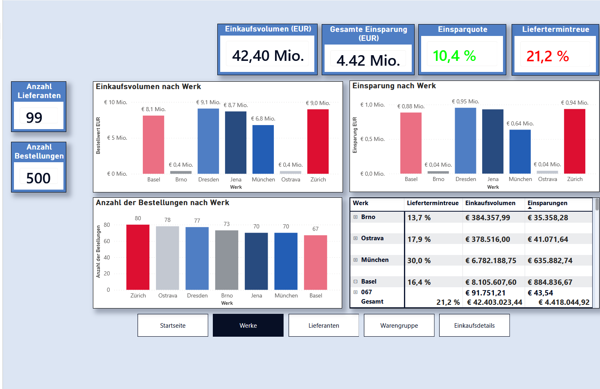
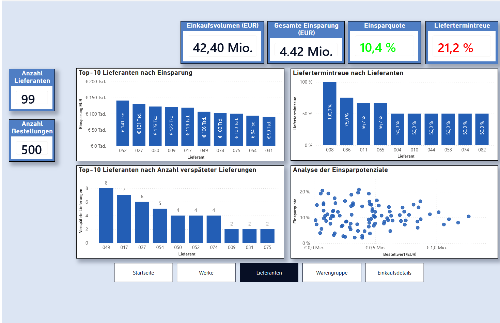
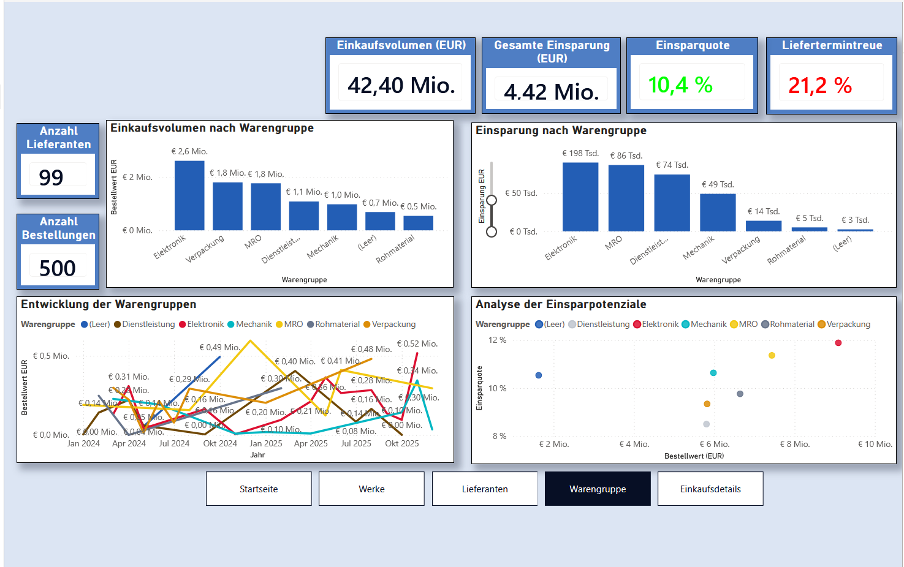
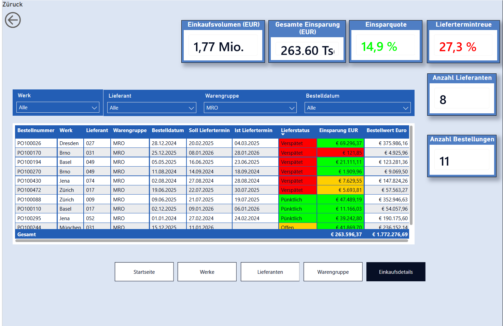

# Power BI Einkaufsanalyse – Procurement Analytics Dashboard

## Projektübersicht

Dieses Projekt zeigt die Entwicklung eines interaktiven **Power-BI-Dashboards zur Analyse der Einkaufs- und Lieferantenperformance** eines internationalen Produktionsunternehmens mit sieben europäischen Werken.

Ziel war es, Einkaufsdaten aus einem SAP-Umfeld aufzubereiten und daraus ein Management-Dashboard zu entwickeln, das zentrale Einkaufskennzahlen transparent darstellt und eine detaillierte Analyse von **Werken, Lieferanten, Warengruppen und einzelnen Bestellungen** ermöglicht.

Da sich die Werke an unterschiedlichen europäischen Standorten befinden und Bestellungen in verschiedenen Währungen durchgeführt werden, werden die Einkaufswerte für eine einheitliche und standortübergreifende Analyse in **EUR umgerechnet**.

---

## Ausgangssituation

Die Einkaufsleitung benötigt eine zentrale Übersicht, mit der die Performance des Einkaufs sowie der Lieferanten bewertet werden kann.

Die bereitgestellten Einkaufsdaten enthalten verschiedene Datenqualitätsprobleme und müssen vor der eigentlichen Analyse zunächst geprüft, bereinigt und für die Auswertung vorbereitet werden.

Das Dashboard soll sowohl eine schnelle Managementübersicht ermöglichen als auch detaillierte Analysen bis auf Bestellebene unterstützen.

---

## Business Questions

Das Dashboard wurde entwickelt, um unter anderem folgende Fragestellungen zu beantworten:

- Wie hoch ist das gesamte Einkaufsvolumen?
- Wie hoch sind die erzielten Einsparungen?
- Wie hoch ist die Einsparquote?
- Wie hoch ist die Liefertermintreue?
- Welche Lieferanten haben das höchste Einkaufsvolumen?
- Welche Lieferanten erzielen die höchsten Einsparungen?
- Welche Lieferanten verursachen die meisten verspäteten Lieferungen?
- Welche Werke haben das höchste Einkaufsvolumen?
- Wie unterscheiden sich die Werke hinsichtlich Einsparungen und Liefertermintreue?
- Welche Warengruppen entwickeln sich positiv oder negativ?
- Wo bestehen potenzielle Einsparmöglichkeiten?
- Wie verteilt sich das Einkaufsvolumen auf verschiedene Währungen?
- Wie können Einkaufswerte verschiedener Standorte einheitlich in EUR verglichen werden?

---

## Zentrale KPIs

Für die Analyse wurden verschiedene Einkaufskennzahlen umgesetzt:

- Einkaufsvolumen
- Gesamte Einsparung
- Einsparquote
- Liefertermintreue
- Anzahl der Bestellungen
- Anzahl der Lieferanten
- Verspätete Lieferungen
- Einkaufsvolumen nach Werk
- Einsparungen nach Werk
- Einkaufsvolumen nach Warengruppe
- Einsparungen nach Warengruppe
- Top-10-Lieferanten nach Einkaufsvolumen
- Top-10-Lieferanten nach Einsparungen

---

## Dashboard

### 1. Management-Übersicht

Die Startseite stellt die wichtigsten Einkaufskennzahlen auf Managementebene dar. Neben Einkaufsvolumen, Einsparungen, Einsparquote und Liefertermintreue werden unter anderem die wichtigsten Lieferanten, Werke und verwendeten Währungen dargestellt.

---

### 2. Werksanalyse

Die Werksanalyse ermöglicht den Vergleich der sieben Produktionsstandorte anhand von Einkaufsvolumen, Einsparungen, Bestellanzahl und Liefertermintreue.

---

### 3. Lieferantenanalyse

Auf der Lieferantenseite werden Lieferanten hinsichtlich Einkaufsvolumen, Einsparungen und Lieferperformance analysiert.

Neben den Top-Lieferanten können insbesondere Lieferanten mit verspäteten Lieferungen sowie mögliche Einsparpotenziale identifiziert werden.

---

### 4. Warengruppenanalyse

Die Warengruppenanalyse zeigt die Verteilung und zeitliche Entwicklung des Einkaufsvolumens sowie der Einsparungen nach Warengruppe.

Dadurch können Veränderungen im Einkaufsverhalten sowie Warengruppen mit erhöhtem Einsparpotenzial identifiziert werden.

---

### 5. Einkaufsdetails

Die Detailansicht ermöglicht eine Analyse bis auf einzelne Bestellungen.

Dargestellt werden unter anderem:

- Bestellnummer
- Werk
- Lieferant
- Warengruppe
- Bestelldatum
- Soll-Liefertermin
- Ist-Liefertermin
- Lieferstatus
- Einsparung
- Bestellwert

---

## Drillthrough & Interaktivität

Eine zentrale Funktion des Dashboards ist die **Drillthrough-Analyse**.

Aus den verschiedenen Analyseansichten kann direkt auf die Einkaufsdetails gewechselt werden. Dabei wird der aktuelle Filterkontext automatisch übernommen.

Dadurch können beispielsweise ein bestimmtes **Werk, ein Lieferant oder eine Warengruppe gezielt bis auf Bestellebene analysiert** werden.

Zusätzlich ermöglichen Filter, Slicer und Navigationsbuttons eine intuitive Navigation zwischen den einzelnen Analysebereichen.

---

## Ampellogik

Für ausgewählte Kennzahlen und Detailinformationen wurde eine **Ampellogik mittels bedingter Formatierung** implementiert.

Dadurch können beispielsweise:

- kritische Lieferperformance,
- verspätete Lieferungen,
- Einsparpotenziale und
- positive bzw. negative KPI-Entwicklungen

schnell visuell erkannt werden.

---

## Währungsumrechnung

Da die Einkaufsdaten aus mehreren europäischen Standorten stammen, enthalten die Bestellungen unterschiedliche Währungen.

Für eine einheitliche Analyse werden die Einkaufswerte mithilfe hinterlegter Wechselkurse in **EUR umgerechnet**.

Dadurch können Einkaufsvolumen und Einsparungen standortübergreifend miteinander verglichen und aggregiert werden.

---

## Datenaufbereitung

Vor der Visualisierung wurden die Ausgangsdaten für die Analyse vorbereitet und auf Datenqualität geprüft.

Zu den wesentlichen Schritten gehören:

- Prüfung und Bereinigung der Ausgangsdaten
- Behandlung fehlender oder fehlerhafter Werte
- Vereinheitlichung relevanter Datenfelder
- Aufbereitung von Datumsfeldern
- Ableitung des Lieferstatus anhand von Soll- und Ist-Liefertermin
- Berechnung relevanter Einkaufskennzahlen
- Währungsumrechnung in EUR
- Vorbereitung der Daten für die Analyse in Power BI

---

## Verwendete Technologien

- **Microsoft Power BI**
- **Power Query**
- **DAX**
- Datenbereinigung und Transformation
- Datenmodellierung
- KPI-Entwicklung
- Bedingte Formatierung
- Drillthrough
- Interaktive Datenvisualisierung
